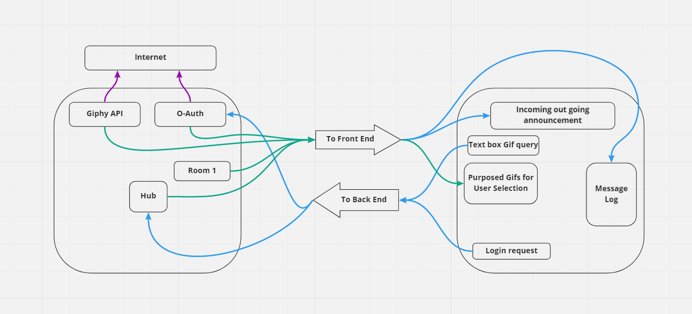

# GIF MESSAGING SERVICE
- A messaging service that uses only Gifs 

- Jarrell "[Jarrell28](https://github.com/Jarrell28)" Houston

- Julien "[TrunkOfUkuleles](https://github.com/TrunkOfUkuleles)" Edwards

- Ted "[Ritzoosk](https://github.com/Ritzoosk)" Knecht

## User Stories
- As a user I would like to login using other account verification and not have to make a new login.
- As a user I want to know who is in a particular chat room and know when new people arrive or leave.
- As a user I want to select a Gif to send based on a simple search word I type in.
- As a user I want to easily navigate between rooms/channels
- As a user I want a "feeling lucky" button to randomly choose a Gif from the presented search options.

## Feature Tasks
- Oauth login and session tokens.
- Chat rooms show when users are added or removed
- Get Giphy API to display a selection of gifs based on a search query
- Allow for multiple rooms (private?)
- Random Gif selection button

## Acceptance Tests
- Ensure successful login via O-Auth.
- Ensure users are informed other others entering and leaving rooms
- Ensure sufficient amount of selections are presented to the user after search query.
- Get multiple rooms running and working, allowing users to move between them.
- Ensure a "feeling lucky" allows for a randow automatic selection and reply of a Gif.

# DOM Model

# TEAM AGREEMENT

## Cooperation Plan

### What are the key strengths of each person on the team?
- Jarrell - Knows frontend and backend, logic, react, troubleshooting
- Julian - React, presentation, frameworks.
- Ted - Planning, organization, UI/UX, markdown:)

### How can you best utilize these strengths in the execution of your project?

- By working together to strengthen eachother. Those strong in something should drive others and help them understand as they go.

### In which professional competencies do you each want to develop greater strength?

- Jarrell - Dev ops, AWS Integrations
- Julian - Realtime application
- Ted - React, frontend backend

### Knowing that every person in your team needs to understand all aspects of the project, how do you plan to approach the day-to-day work?

- Conduct stand up and set goals for the day, plan to reassess around noon.

- 9-9:45 prep for stand up with Brian 
- Break
- 10-12 divide and conquer set task, focusing on MVP and getting to the set goals ASAP.
- Lunch
- 1-4 Assess any ongoing bugs, focus and share found resources and then go back into coding and testing as we go
- 4-8 Set a stopping point based on goal completion

## Conflict Plan

### What will be your group’s process to resolve conflict, when it arises?
- We will check group understanding and feedback. This is the best way to discover possible future conflicts and discuss them before issues arise 

### What will your team do if one person is taking over the project and not letting the other members contribute?
- We will directly discuss individual contributions in the morning. Team members are encourage to denote how much they feel they have been able to contribute. This will help identify "over-performers" and have targeted disscusions on how to adjust workload or roles.

### How will you approach each other and the challenges of the project knowing that it is impossible for all members to be at the exact same place in understanding and skill level?
- With a 3 member team we could just agree to goto a vote on the first conflict only. From there forward we will need to disscuss pro and cons then present the information to a third party for selection.

### How will you raise concerns to members who are not adequately contributing?
- This is handle previously when we intentionally address contribution levels in the morning meeting and have those that contributed less start by driving that day.

### How and when will you escalate the conflict if your resolution attempts are unsuccessful?
- If it ever gets heated we will go to a cool down break. All members will go on a manditory break and the team will reconieve with a thrid party present to deescalate and  decide hoow we should move forward.

## Communication Plan

### What hours will you be available to communicate?
- minimum hours are school hours 9 - 4. additional contribution is expected between 4-10, this will be decided based on workload and personal obligation. 

### What platforms will you use to communicate (ie. Slack, phone …)?
- Primarily slack and Remo, a [GitHub group](https://github.com/GIFSMS/GIFSMS)  has been started as well.

### How often will you take breaks?
- most break should be expected around the hour mark, otherwise members are expected to self manage breaks.

### What is your plan if you start to fall behind?
- to engauge leadership and TA's. Most likely receeding to a simpler MVP should put us back on track.

### How will you communicate after hours and on the weekend?
- Slack we have agreed to give eachothers cells in the case someone cant be reached and there is git issues.

### What is your strategy for ensuring everyone’s voice is heard?
- Our morning meetings are focus on the days work but mainly on heading off any potential issues especially those associated.

### How will you ensure that you are creating a safe environment where everyone feels comfortable speaking up?
- We will start our first meeting by addressing individual "triggers". Especially those associated with our remote environment as we will be spending a lot of time together. Prefer mic mute default? quiet stints? eating sounds? pronouns? That way other members of the team are encourage to look out for anothers pet peve and be able to bring it up for them or ensure its addressed more promptly.

